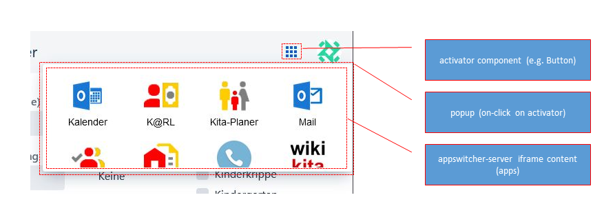

# appswitcher-vaadin

Provides a Vaadin Flow (24+) component (`Appswitcher`) to embed an `<iframe>` with the content of [appswitcher-server](https://github.com/it-at-m/appswitcher-server).



## Usage

### Dependency (Maven)

```xml
<dependency>
  <groupId>de.muenchen.oss.appswitcher</groupId>
  <artifactId>appswitcher-vaadin</artifactId>
  <version><!-- see Releases --></version>
</dependency>
```

### Use

Example:

```java
import de.muenchen.oss.appswitcher.vaadin.Appswitcher;

public class MyVaadinView extends Div {

    public MyVaadinView() {
        add(Appswitcher.builder("https://my-appswitcher-server.example.com")
        		// request tags according to your needs
            .tags("global", "finance")
            .build());
    }
}
```

## Development

### Important Files 

* Appswitcher.java: this is the addon-on component class. You can add more classes if you wish, including other Components.
* TestView.java: A View class that let's you test the component you are building. This and other classes in the test folder will not be packaged during the build. You can add more test view classes in this package.
* src/main/assembly/: this folder includes configuration for packaging the project into a JAR so that it works well with other Vaadin projects and the Vaadin Directory. There is usually no need to modify these files, unless you need to add JAR manifest entries.


### Deployment

Starting the test/demo server:
```
mvn jetty:run
```

This deploys demo at http://localhost:8080
